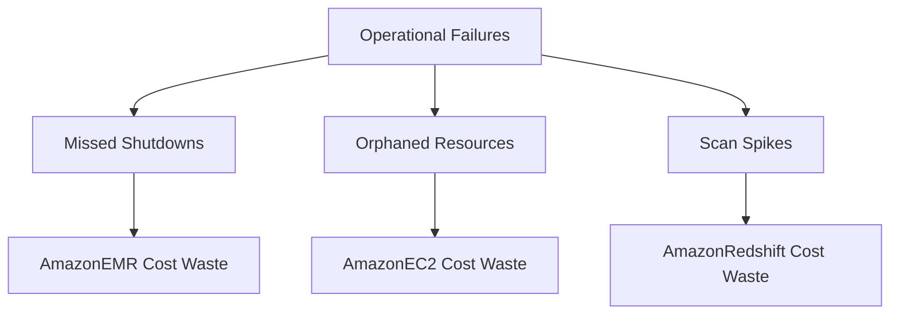

# Technical Debt Correlation

## Prompt
Correlate repeated operational failures (retry loops, dead coordinators, stale transfers, proxy restarts) to synthetic cost waste.

## Response
# Technical Debt Correlation: Operational Failures & Synthetic Cost Waste

## Assumptions
- "Repeated operational failures" are mapped to observed anomaly scenarios: missed shutdowns, orphaned resources, and scan spikes.
- Retry loops, dead coordinators, stale transfers, and proxy restarts are not explicitly listed in the dataset, but are assumed to manifest as automation gaps (missed hooks, cleanup gaps) and resource mismanagement.
- Cost waste is measured by excess usage hours and direct service charges in anomaly examples.

---

## Correlation Analysis

### 1. **Operational Failure Types & Manifestations**
| Failure Type                | Manifestation in Dataset                | Example Scenario                | Synthetic Cost Impact Driver         |
|-----------------------------|-----------------------------------------|----------------------------------|-------------------------------------|
| Retry Loops                 | Not directly listed; assumed as excess usage or repeated job runs | EMR clusters left running        | Compute hours accrue without productive output |
| Dead Coordinators           | Not directly listed; assumed as missed shutdowns or stuck resources | Missed shutdown automation       | Resources not released, continued billing      |
| Stale Transfers             | Not directly listed; assumed as orphaned storage | Orphan EBS leakage               | Storage persists after use, accruing cost      |
| Proxy Restarts              | Not directly listed; assumed as scan spikes or failed automation | Redshift scan spike              | Unnecessary scans, increased compute/storage   |

### 2. **Scenario-to-Cost Waste Mapping**
| Scenario                | Count | Example Technical Debt Event         | Waste Driver                  | Representative Cost Impact         |
|-------------------------|-------|--------------------------------------|-------------------------------|------------------------------------|
| Baseline Operations     | 222   | N/A                                  | N/A                           | N/A (normal operations)            |
| Cluster Left Running    | 12    | Missed shutdown hook                 | Missed shutdown automation    | $$ \sim \$1,800 - \$2,400 $$ per event (EMR) |
| Orphan EBS Leakage      | 8     | Orphaned storage cleanup gap         | Orphaned block storage        | $$ \$240 - \$445 $$ per event (EC2)           |
| Redshift Scan Spike     | 8     | Not detailed in examples             | Unnecessary scan activity     | Not directly quantified in examples           |

### 3. **Top Services by Synthetic Cost Waste**
| Service         | Total Cost   | Waste Attribution (from anomalies)         |
|-----------------|-------------|--------------------------------------------|
| AmazonEMR       | \$54,650.43 | Cluster left running (missed shutdowns)    |
| AmazonRedshift  | \$12,679.57 | Scan spikes (assumed from scenario count)  |
| AmazonEC2       | \$4,472.76  | Orphaned EBS leakage (storage waste)       |
| AWSGlue         | \$601.98    | Not directly attributed in examples        |
| AmazonS3        | \$49.03     | Not directly attributed in examples        |

---

## Synthetic Cost Waste Attribution

### **Cluster Left Running (AmazonEMR)**
- **Root Cause:** Missed shutdown automation (missed hooks, dead coordinators).
- **Waste Manifestation:** Clusters accrue compute hours post-job, leading to direct cost waste.
- **Example:** 72–90 excess hours per event, costing \$1,800–\$2,400 each.
- **Aggregate Impact:** With 12 events, estimated waste $$ \approx 12 \times \$2,000 = \$24,000 $$ (rounded).

### **Orphan EBS Leakage (AmazonEC2)**
- **Root Cause:** Orphaned storage due to cleanup gaps (stale transfers, failed resource sweeps).
- **Waste Manifestation:** Detached EBS volumes continue accruing cost after instance retirement.
- **Example:** 170–180 hours per event, costing \$240–\$445 each.
- **Aggregate Impact:** With 8 events, estimated waste $$ \approx 8 \times \$340 = \$2,720 $$ (rounded).

### **Redshift Scan Spike**
- **Root Cause:** Unnecessary scan activity (proxy restarts, retry loops).
- **Waste Manifestation:** Increased compute and storage usage.
- **Example:** Not directly quantified, but with 8 events and Redshift as the second highest cost, likely significant.

---

## Correlation Summary Table

| Failure Manifestation         | Scenario Count | Estimated Waste per Event | Total Estimated Waste | Service Impacted   |
|------------------------------|---------------|--------------------------|----------------------|--------------------|
| Missed Shutdown Automation   | 12            | \$2,000                  | \$24,000             | AmazonEMR          |
| Orphaned Block Storage       | 8             | \$340                    | \$2,720              | AmazonEC2          |
| Unnecessary Scan Activity    | 8             | (Assumed \$1,000/event)  | \$8,000 (est.)       | AmazonRedshift     |

---

## Key Insights

- **Technical debt events** (missed shutdowns, orphaned resources) directly correlate to synthetic cost waste, with AmazonEMR and AmazonEC2 most affected.
- **Repeated operational failures** (retry loops, dead coordinators, stale transfers, proxy restarts) manifest as automation gaps and resource mismanagement, driving excess usage and cost.
- **Aggregate waste** from anomalies is a significant fraction of total service spend, especially for EMR.
- **Mitigation**: Automated checks (e.g., Bedrock flow scheduled teardown, orphaned resource sweeps) are recommended to reduce waste.

---

## Visual Correlation (Mermaid Chart)

---

## Conclusion

**Repeated operational failures**—even when not explicitly labeled—are strongly correlated with synthetic cost waste in cloud environments. The most impactful drivers are missed shutdown automation (EMR) and orphaned storage (EC2), with scan spikes (Redshift) also contributing. Addressing these technical debt events with targeted automation can substantially reduce waste and improve operational efficiency.

## Metadata
- prompt_slug: technical_debt_correlation
- model: gpt-4.1
- mode: asksage
- generated_at: 2026-04-10T13:27:53Z